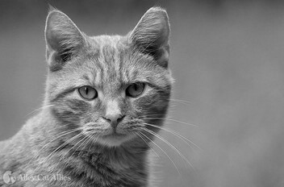
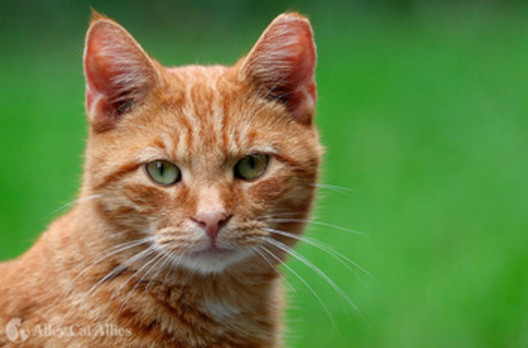
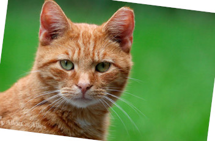

# Image Deduplication

This is a simple cli tool for finding and removing duplicate images written in pure Go. A duplicate image is any image that has similar visual content to another. This is done with perceptual hashing of the image.

It is capable of finding duplicates with various changes in size, rotation, brightness, saturation or contrast.

It cannot find duplicates that undergo extreme transforms or major changes to the visual content like color inversion, cropping, full rotation or flipping. The detection method works on the visual content of the file but does not do anything semantic in that the same subject on a different background would likely not be detected.

As an example all the images below are transformed from the first cat image and will be flagged as duplicates.

        

```bash
dedupe testimages/cats/cat.jpg testimages/cats
```

## Install

Binaries are available for each [release](https://github.com/alexgQQ/dedupe/releases). Download and use whichever for your system. For now this only contains binaries for Intel based Windows and Linux systems.

Alternatively you can install through go or build it from source. This requires Go version 1.23+.
```bash
go install github.com/alexgQQ/dedupe/cmd/dedupe@latest
# or
git clone https://github.com/alexgQQ/dedupe.git
cd dedupe
make build
```

## Usage

There are two main usages. Checking for specific duplicates and checking for any duplicates.
If an image file is provided as the first argument then it will return any duplicates of that image.
For example we can check if two image are duplicates
```bash
dedupe image.jpg image-copy.jpg
```
Or we can find duplicate occurrences of an image across other directories
```bash
dedupe image.jpg path/to/images path/to/other/images
```

Otherwise if the first argument is a directory it will search and return any duplicates found
```bash
dedupe path/to/images
```
Alternatively you can provide a flag to force it into this search mode. This is most relevant if passing a file of images to handle.
```bash
cat images.txt | dedupe --search -
```
The cli is designed to work with pipelining in this way too. You can generate a csv like list of duplicates from that list of images like this.
```bash
cat images.txt | dedupe --search -o - > duplicates.csv
```
More flag usage and options are listed in the help message.
```bash
dedupe --help
```

You can also import this package and use it in your code
```bash
go get github.com/alexgQQ/dedupe@latest
```
and in your code
```golang
package main

import (
	"fmt"
	"strings"

	"github.com/alexgQQ/dedupe"
)

func main() {

	images := []string{
		"testimages/cats/cat-on-couch.jpg",
		"testimages/cats/cat.jpg",
		"testimages/cats/cat-shrink.jpg",
	}

	results, total, _ := dedupe.Duplicates(dedupe.DCT, images)
	fmt.Printf("Found %d duplicates\n", total)
	if total <= 0 {
		return
	}
	for _, files := range results {
		msg := strings.Join(files, ", ")
		fmt.Printf("%s\n", msg)
	}
}
```

## Development

It's a straightforward package so clone and use whatever go workflow you like. The cli at cmd/dedupe/main.go is the best entrypoint and I'd recommend to have the verbose flag set and point it at the test images in the repo. Configure your debugger to do that.
```bash
go run cmd/dedupe/main.go -v -t testimages
```

Keep it clean and tidy
```bash
make fmt && make test
```

Issues and contributions are welcome. Guidelines are pretty loose:
* For any large change please open an issue to have some discussion (for small changes feel free to just fork this and open a PR).
* Don't add external dependencies

### Implementation

The process works by computing images perceptual hashes and using a vantage point tree to find hashes close to each other by their hamming distance. The hashing method has an impact and this currently implements the [dhash](https://www.hackerfactor.com/blog/index.php?/archives/529-Kind-of-Like-That.html) and [dct](https://github.com/alangshur/perceptual-dct-hash?tab=readme-ov-file#perceptual-hash-algorithm) perceptual hashes. Reasonable thresholds are defined from [here](https://phash.org/docs/design.html) and the dhash implementation description. By default the dct method is used as it is more accurate and resilient to image variation. However the dhash method is a bit faster and might be more appropriate for large amounts of images at the cost of some accuracy. For now this is sufficient but would be fun to implement more hashing methods like average hash or radial hash.

### Test Images

The testimages directory contains some images to test against. These are a collection of cat images and images from a wallpaper dump. In particular these images have variation of direct duplicates, recolorings, and similar looking images for a solid test case. We can observe the accuracy difference between dhash and dct against these.

### Building For Additional Targets

I find the [elastic golang crossbuild image](https://github.com/elastic/golang-crossbuild) to be very helpful. There's lots of documentation on how to use it but for now I mainly target linux and windows amd64 targets. At some point it would be good to do this for OSX targets but it's more of a hassle. Mac users should build from source. How to manually build:
```bash
GOVERSION=1.24.3
docker run \
  -v .:/go/src/github.com/alexgQQ/go-image-deduper \
  -w /go/src/github.com/alexgQQ/go-image-deduper \
  -e CGO_ENABLED=0 \
  -e BINARY=dedupe.linux \
  docker.elastic.co/beats-dev/golang-crossbuild:${GOVERSION}-main \
  --build-cmd "make build" \
  -p linux/amd64

docker run \
  -v .:/go/src/github.com/alexgQQ/go-image-deduper \
  -w /go/src/github.com/alexgQQ/go-image-deduper \
  -e CGO_ENABLED=0 \
  -e BINARY=dedupe.window.exe \
  docker.elastic.co/beats-dev/golang-crossbuild:${GOVERSION}-main \
  --build-cmd "make build" \
  -p windows/amd64
```
